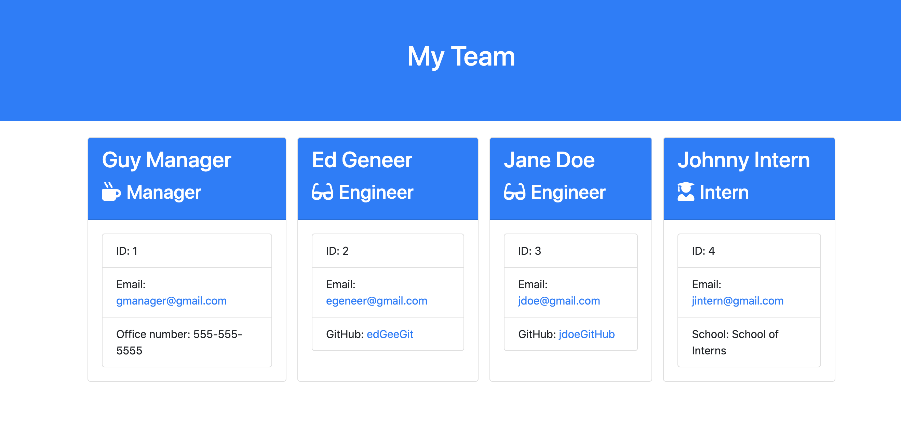

# Employee Template Generator

## Description 

This is a team template generator which uses the CLI to create a webpage containing members of your team.
Inquirer and Node were used for the JS and Boostrap was used for the CSS styling.

## Table of Contents

    * [Installation](#installation)
    * [Usage](#usage)
    * [Credits](#credits)
    * [License](#license)

## Installation

To install the project, simply run npm install to download all dependencies. Then run node app to start the application.

## Usage 

See above

## Credits

Andrew Freire, 2020

## License

## Badges

 

## Contributing

 There are no contributors at this time.

## Tests

Simply type NPM run test in the terminal to run the test scripts using Jest.

